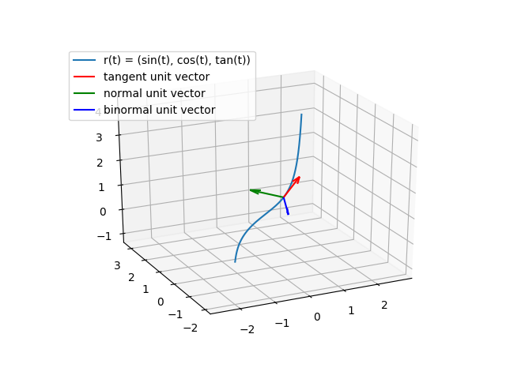

# Differential geometry labs

## Lab №1

Create a python script, that by a parametrization of a curve must:

- visualize a curve;
- for given value of parameter find unit tangent, normal and binormal vectors (visualize would be +);
- for given value of parameter find normal, osculating and reference planes equations;
- for given value of parameter calculate curvature and torsion;
- for given value of parameter find osculating circle.

## Lab №2

Create a python script, that by a general curve equation (intersection of two surfaces) must:

- for given point find unit tangent, normal and binormal vectors;
- for given point find normal, osculating and reference planes equations;
- for given point calculate curvature and torsion;
- for given point find osculating circle.

## Output examples
- Example of curve visualization in lab 1:
    
    
- Example of output for lab 2:
```
For curve
F: x**2 + y**2 + z**2 - 3,
G: x**2 + y**2 - 2,
at point (1, 1, 1):

# ===== Checking conditions of implicit function theorem ===== #
1) Suppose, that F, G є C^inf
2) F((1, 1, 1)) = G((1, 1, 1)) = 0
3) Checking jacobians

	if variable z is dependent:
Jacobian d(f, g) / d(x, y) at point (1, 1, 1) is |Matrix([[2, 2], [2, 2]])| = 0
	if variable y is dependent:
Jacobian d(f, g) / d(z, x) at point (1, 1, 1) is |Matrix([[2, 2], [0, 2]])| = 4
# =================== Condition checked! ===================== #

	tangent unit vector: [-0.70710678  0.70710678  0.        ]
	normal unit vector: [-0.70710678 -0.70710678  0.        ]
	binormal unit vector: [0. 0. 1.]
	osculating plane: 2*z - 2 = 0
	normal plane: -0.707106781186547*x + 0.707106781186547*y = 0
	reference plane: 0.707106781186547*x + 0.707106781186547*y - 1.41421356237309 = 0
	curvature: 0.7071067811865474
	torsion: 0
	# osculating circle <=> intersection of osculating sphere and osculating plane
	osculating sphere: (x + 2.22044604925031e-16)**2 + 4.0*(0.5*y - 1)**2 + (z - 1.0)**2 - 2.0 = 0
	osculating plane: 2*z - 2 = 0

Time elapsed: 0.2811110019683838
```